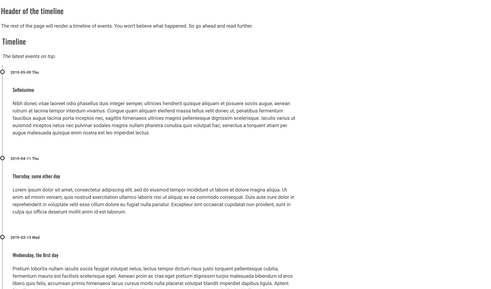

# org-timeline

Simple css theme for exporting an org-mode file as a timeline, like [this](http://codepen.io/NielsVoogt/pen/MbMMxv/) one, where I stole the css from.



## How to use
Include this at the top of your org-mode file:
```
#+SETUPFILE: http://elisescu.com/org-timeline/setup/html.setup
```
The `html.setup` file is the same as `setup/html.setup`. So if I forgot, and removed it from the link above, you can use it directly from this repo.

Then in your org file, you will need a particular structure, like:
```
* Timeline
  :PROPERTIES:
  :HTML_CONTAINER_CLASS: timeline-container
  :END:
/The latest events on top./
** 2019-05-09 Thu
*** Sefinissimo
```

- `:HTML_CONTAINER_CLASS: timeline-container` property will have to be present in the top-level headline
- the second-level headlines will be displayed on the vertical timeline, small font next to the dots (the date in my example)
- the third-level headlines, and downwards, will be the content of the timeline.

But better take a look at the example, and at the code.

## Example
See the [example/example.org](example/example.org) which should render like [this](http://elisescu.com/org-timeline/example/example.html).

## Credits
- [org-macros](https://github.com/fniessen/org-macros)
- [org-html-themes](https://github.com/fniessen/org-html-themes/)
- [Inspiration](https://freefrontend.com/css-timelines/)
- [CSS copied from this demo](http://codepen.io/NielsVoogt/pen/MbMMxv/)
- [Downloaded from](https://freefrontend.com/assets/zip/css-timelines/single-div-timeline.zip)

